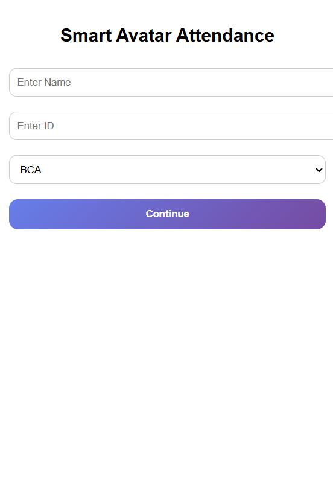
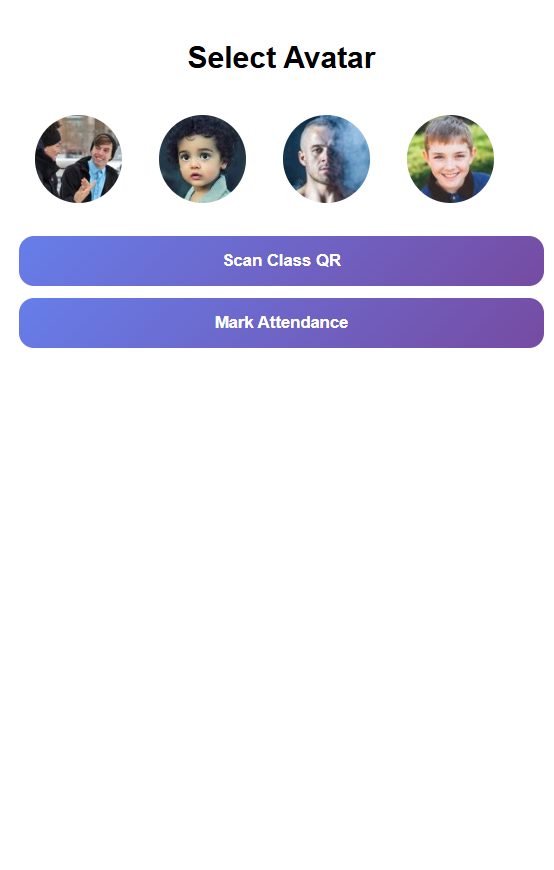
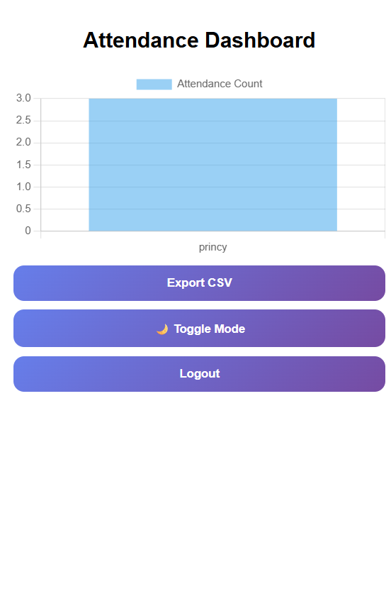

# SmartAI Attendance System 🎓🤖

## Problem Statement

Traditional attendance systems in colleges and organizations are time-consuming, manual, and prone to proxy attendance. 
Teachers spend valuable lecture time calling roll numbers, and manual records are difficult to manage and analyze.

There is a need for a smart, automated, and secure attendance system that saves time and prevents proxy entries.

---

## Solution

SmartAI Attendance System uses AI-powered Face Recognition to automatically detect and mark student attendance in real-time.

The system:
- Captures live video from camera
- Detects faces using computer vision
- Matches faces with registered student database
- Automatically marks attendance in a digital record

This eliminates manual work and reduces fake attendance.

---

## Features

- 🎯 Real-time Face Detection & Recognition
- 📊 Automatic Attendance Marking
- 🗂 Student Database Management
- 📅 Date-wise Attendance Records
- 📈 Attendance Report Generation
- 🔐 Secure and Proxy-Free System

---

## Tech Stack

- Python
- OpenCV
- Face Recognition Library
- NumPy
- Pandas
- Tkinter / Flask (for UI)
- CSV / Database (for storage)

---

## How to Run

1. Clone the repository:
   git clone https://github.com/yourusername/SmartAI-Attendance.git

2. Navigate to project folder:
   cd SmartAI-Attendance

3. Install dependencies:
   pip install -r requirements.txt

4. Run the application:
   python app.py

5. Allow camera access and start attendance.

---

## Future Scope

- 🌐 Cloud-based storage system
- 📱 Mobile application integration
- 🧠 Advanced Deep Learning Model
- 🏫 Multi-classroom & multi-college scalability
- 🔔 SMS / Email notification to parents
- 📊 AI-based attendance analytics dashboard

This system can be scaled into a SaaS-based EdTech startup targeting schools, colleges, and corporate offices.

---

## Demo

Example:

(Add demo video link here)
